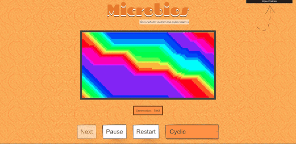
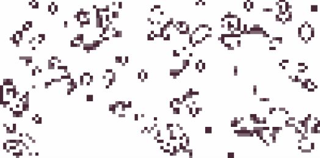
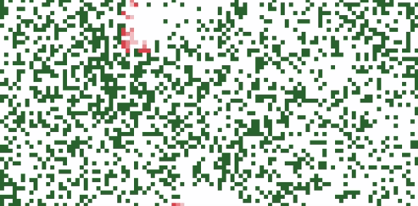

# microbios - [live website](https://cyrilf.github.io/microbios/)



_Cyclic experiment running on the demo website_

Find more **experiments** on [the live demo version](https://cyrilf.github.io/microbios/) 💡

----

## DESCRIPTION 📖

**Microbios** provide a generic code that allows simulations of **cellular automata** experiments.  
The most famous one being the **Game of Life** (that you can find on the [live version](https://cyrilf.github.io/microbios/) or on the [experiments folder](https://github.com/cyrilf/microbios/tree/5bcf07ffca6d75c2462a3c8af5e05b2dbc402961/src/experiments)).

This is an open-source project, licensed under MIT.

Feel free to submit a PR to create more experiments.

## ROADMAP 🚀

- [ ] 🚒 Extract the simulation code 'engine' out of this vue project (to be an external dependency easily re-usable)
- [ ] 🖌 Extract the rendering logic to be able to draw onto canvas
- [ ] 📑 Write README documentation
- [ ] 🎆 Write more experiments

## THANKS 👌

Thanks to The Coding Train who inspired me with his [video on cellular automata](https://www.youtube.com/watch?v=DKGodqDs9sA).  
Thanks to [@sanojian](https://github.com/sanojian) who provided good code inspiration through his project [cellauto](https://github.com/sanojian/cellauto).  
Thanks to [@nemtsov](https://github.com/nemtsov) for the vue-game-of-life [inspiration](https://github.com/nemtsov/conways-game-of-life-vue)

----


## Project setup 💻
```
npm install
```

### Compiles and hot-reloads for development
```
npm run serve
```

### Compiles and minifies for production
```
npm run build
```

### Run your tests
```
npm run test
```

### Lints and fixes files
```
npm run lint
```

### Customize configuration
See [Configuration Reference](https://cli.vuejs.org/config/).

----



_Game of Life experiment_



_Forest Fire experiment_
